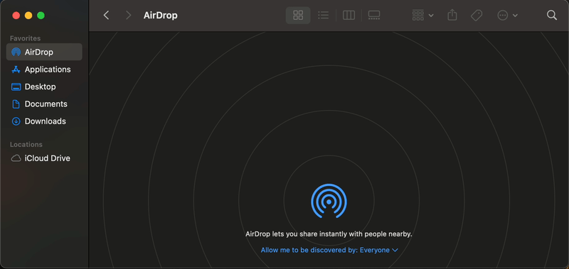

# Receive Airdrop Files On Raspberry Pi

This project is a fork of the [`/seemoo-lab/nexmon`](https://github.com/seemoo-lab/nexmon) project with an updated instruction set for the Raspberry Pi.

These instructions have been tested and work with the `bcm43436b0` WiFi chipset found on the **Raspberry Pi Zero 2 W**. 

This is possible with [`/seemoo-lab/opendrop`](https://github.com/seemoo-lab/opendrop), [`/seemoo-lab/owl`](https://github.com/seemoo-lab/owl) and the [`/seemoo-lab/nexmon`](https://github.com/seemoo-lab/nexmon) patches to enable monitor mode on the WiFi chip, which is required for Airdrop. For a different Raspberry Pi model, check the supported devices section in the README of the [`/seemoo-lab/nexmon`](https://github.com/seemoo-lab/nexmon) repository.



## Findings

Only Mac Computers (was tested running Sonoma 14.3.1) and certain older iOS devices (or older iOS versions?) are able to discover Raspberry Pi for Airdrop. You can read more about the issue [here](https://github.com/seemoo-lab/opendrop/issues/80).

I also extracted an Apple ID Validation Record, Certificate, and Key for AirDrop following this [guide](https://github.com/seemoo-lab/airdrop-keychain-extractor), to see if it would resolve the iOS issue. It did not fix the issue for newer iOS devices, however, it did clear an error I would occasionally see when trying to search for a newer iOS device about a bad certificate, but then caused another [error](https://github.com/seemoo-lab/opendrop/issues/114). It seems for the time being, these are the current limits of the Opendrop implementation.
## Disclaimer
Read the full disclaimers at [`/seemoo-lab/opendrop`](https://github.com/seemoo-lab/opendrop), [`/seemoo-lab/owl`](https://github.com/seemoo-lab/owl), and [`/seemoo-lab/nexmon`](https://github.com/seemoo-lab/nexmon). 

This project is not affiliated or endorsed by Apple Inc. Use this code at your own risk.

## Instruction Guide

- Download the Proper Raspberry Pi OS:
    + **Nexmon currently supports Kernel Version 4.4 (deprecated), 4.9, 4.14, 4.19, 5.4, 5.10 and 5.15.**
    + However, on kernel 5.15 for the Raspberry Pi Zero 2 W, devices do not appear in OWL. Because of this, we will download the latest available compatible Raspberry Pi OS with available kernel headers, **Kernel Version 5.10.63**, which can be found at [downloads.raspberrypi.com](https://downloads.raspberrypi.com)
    + Also, we will need the 32bit version of the OS, as the zeroconf wheel for OpenDrop is unable to build on the Raspberry Pi Zero 2 W running the 64bit version.
    + Here is a [link](https://downloads.raspberrypi.com/raspios_lite_armhf/images/raspios_lite_armhf-2021-11-08/2021-10-30-raspios-bullseye-armhf-lite.zip) to the compressed img file (2021-10-30-raspios-bullseye-armhf-lite).
-  Load the image to the micro SD card (at least 8gb) (macOS):
    + Uncompress the `.img.zip` to `.img` file by double clicking.
    + Connect SD card and open the Terminal.
        * Run `diskutil list` to find where the SD card is mounted. In this example, we'll assume it's mounted at `/dev/disk4`
        * Unmount the SD card with `diskutil unMountDisk /dev/disk4`
        * Then, go to the directory where the image file is located. For example, `cd Downloads`
        * Write the `.img` file to the SD card with `sudo dd if=2021-10-30-raspios-bullseye-armhf-lite.img of=/dev/disk4 bs=1m`
        * Unmount the SD card `diskutil unMountDisk /dev/disk4`
- Initial Raspberry Pi Setup:
    + Load the SD card in the Raspberry Pi and power on.
    + After the system boots, login with the default username and password for kernel 5.10 `username:pi` `password:raspberry`. It is recommended to create a new password.
    + Then, run `sudo raspi-config`
    + In System Options, input your Wi-fi credentials (and turn on auto login).
    + In Localisation Options, set the correct country for your keyboard layout, and then select "<Finish>" to reboot.

### Installation Guide
- First, install the proper kernel headers for kernel 5.10.63 (32bit). We **cannot** use `sudo apt install raspberrypi-kernel-headers` for this, as it will install the wrong version.
- To install the correct version, we need to download the package from [archive.raspberrypi.com](https://archive.raspberrypi.com)
- In order to find the matching version, we can use this [guide](https://github.com/HinTak/RaspberryPi-Dev/blob/master/Raspbian-Kernel-Releases.md), which tells us we need to search for tag 1.20211029 for kernel version 5.10.63
- Download kernel-headers for 32bit kernel version 5.10.63 (raspberrypi-kernel-headers_1.20211029-1_armhf): 
```
wget http://archive.raspberrypi.org/debian/pool/main/r/raspberrypi-firmware/raspberrypi-kernel-headers_1.20211029-1_armhf.deb
```
- Install the kernel-headers, and delete the .deb package when complete: 
```
sudo dpkg -i raspberrypi-kernel-headers_1.20211029-1_armhf.deb
sudo rm raspberrypi-kernel-headers_1.20211029-1_armhf.deb
```
- Now, we need to set a hold on the kernel-headers and the kernel to prevent them from auto-upgrading [(Guide)](https://github.com/HinTak/RaspberryPi-Dev/blob/master/Downgrading-Pi-Kernel.md). Also, we will need to set a hold on the bootloader as upgrading the bootloader will prevent the Raspberry Pi Zero 2 W from booting: 
```
sudo apt-mark hold raspberrypi-kernel-headers raspberrypi-kernel raspberrypi-bootloader
```
- Update and upgrade Raspbian:
```
sudo apt update
sudo apt upgrade
```
#### Install Nexmon Patches
- Install dependencies:
```
sudo apt install git libgmp3-dev gawk qpdf bison flex make autoconf libtool texinfo
```
- Download Nexmon (I was having some issues cloning it with the git command, so we can use wget):
```
wget https://github.com/seemoo-lab/nexmon/archive/master.zip
```
- Unzip, rename the folder, and delete the old zip file:
```
unzip master.zip
sudo mv nexmon-master nexmon
sudo rm master.zip
```
- Complete the next steps as the root user:
```
sudo su
```
- Compile, install, and link library files for Nexmon (32bit):
```
cd nexmon/buildtools/isl-0.10
./configure
make
make install
ln -s /usr/local/lib/libisl.so /usr/lib/arm-linux-gnueabihf/libisl.so.10
cd ..

cd mpfr-3.1.4
autoreconf -f -i
./configure
make
make install
ln -s /usr/local/lib/libmpfr.so /usr/lib/arm-linux-gnueabihf/libmpfr.so.4
cd ../../
```
- Set up build enviornment for compiling the patches:
```
source setup_env.sh
```
- Compile build tools and extract the ucode and flashpatches from the original firmware files:
```
make
```
- First, install the patches for the `bcm43430a1`. If we don't, you will get an "unable to inject packet" error in OWL. Compile and install the patches:
```
cd patches/bcm43430a1/7_45_41_46/nexmon
make
make install-firmware
cd ../../../../
```
- Now, go to the packages folder for the Wifi chip `bcm43436b0` (Raspberry Pi Zero 2 W). (Folllow this [guide](https://github.com/seemoo-lab/nexmon) for a different board/chipset). Compile and install the patches:
```
cd patches/bcm43436b0/9_88_4_65/nexmon
make
make install-firmware
```
- Go back to the root directory for Nexmon:
```
cd ../../../../
```
- Install nexutil:
```
cd utilities/nexutil
make
make install
```
- Exit as the superuser:
```
exit
```
- The Wi-Fi interface might be blocked after installing the patches. Unblock the Wi-Fi interface:
```
rfkill unblock wifi
```
#### Install OWL (Open Wireless Link) [(Guide)](https://owlink.org/2019/05/16/howto-use-airdrop-on-raspberry-pi-3.html)
- Install dependencies:
```
sudo apt install libpcap-dev libev-dev libnl-3-dev libnl-genl-3-dev libnl-route-3-dev cmake
```
- Download the OWL repository:
```
git clone https://github.com/seemoo-lab/owl.git
```
- Enter the root folder of the repository:
```
cd owl
```
- Update the submodules:
```
git submodule update --init --remote --merge
```
- Install OWL:
```
mkdir build
cd build
cmake ..
make
sudo make install
```
- Reboot:
```
sudo reboot
```
#### Install OpenDrop
- Install dependencies:
```
sudo apt install python3 python3-pip libjpeg-dev libopenjp2-7-dev
```
- Download the OpenDrop repository:
```
git clone https://github.com/seemoo-lab/opendrop.git
```
- Install OpenDrop:
```
sudo pip3 install ./opendrop -v
```
#### Start receiving files through Airdrop on your Raspberry Pi
- At this point, the internet is no longer required to Airdrop.
- For Nexmon to function properly, disable the `dhcpcd.service` and the `wpa_supplicant.service`. This will temporarily disable the onboard Wi-fi.
- Also, the Nexmon patches require a reinstall after every reboot.
- We can create a bash script to disable the services, reinstall the patches, run OWL, and then start Opendrop.
- Create a new file in the home directory:
```
touch airdrop.sh
```
- Open the file in the text editor:
```
sudo nano airdrop.sh
```
- Add the following lines (previous Nexmon install steps and steps from this [guide](https://owlink.org/2019/05/16/howto-use-airdrop-on-raspberry-pi-3.html) with output silenced):
```
USERNAME="${SUDO_USER:-${USER}}"
echo "Disabling dhcpcd and wpa_supplicant."
systemctl stop dhcpcd
systemctl stop wpa_supplicant
echo "Installing patches..."
cd /home/"$USERNAME"/nexmon
source setup_env.sh
cd /home/"$USERNAME"/nexmon/patches/bcm43436b0/9_88_4_65/nexmon
make install-firmware > /dev/null 2>&1
cd /home/"$USERNAME"/nexmon/utilities/nexutil
make install > /dev/null 2>&1
cd /home/"$USERNAME" # Directory for airdrop files
rfkill unblock wifi
iw phy `iw dev wlan0 info | gawk '/wiphy/ {printf "phy" $2}'` interface add mon0 type monitor
ifconfig mon0 up
nexutil -k6
echo "Starting Open Wireless Link"
owl -i mon0 -N > /dev/null 2>&1 &
sleep 2
opendrop receive > /dev/null 2>&1 &
echo "Airdrop receive started"
```
- Save and close the file.
- Allow the script to be run with root privileges:
```
sudo chown root:root airdrop.sh
```
- Run the script (this will launch OWL and Opendrop as background processes):
```
sudo bash airdrop.sh
```
- You should now be able to receive a file through Airdrop from a Mac with its discovery set to *Everyone*.
- **Note:** You may have to close and open the Airdrop Finder window a few times before you see the Raspberry Pi discovered.
- To restore the onboard Wi-fi and end the Airdrop session, reboot:
```
sudo reboot
```
#### View connection outputs
- If you would like to see how devices are discovered, remove the `> /dev/null 2>&1` from the OWL start line in the script.
- In airdrop.sh, replace:
```
owl -i mon0 -N > /dev/null 2>&1 &
```
- with:
```
owl -i mon0 -N &
```
## Acknowledgements

 - [seemoo-lab](https://github.com/seemoo-lab)
 - [owlink](https://owlink.org/code/)
 - [HinTak](https://github.com/HinTak/RaspberryPi-Dev)
 - And the community of people contibuting to forums online